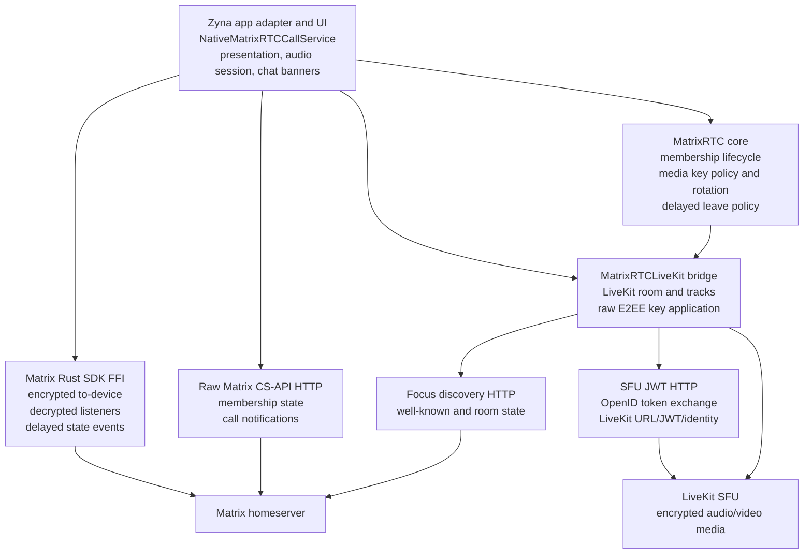

# Native MatrixRTC Calls

Zyna's native MatrixRTC path is the iOS implementation of Matrix calling:
encrypted audio, video, and group calls that interoperate with Element Call
participants.

It replaces the WebView-based Element Call call client with a native Swift
backend while preserving the MatrixRTC wire format used by Element Call and
matrix-js-sdk.

This document is the technical reference for the architecture, dependencies,
forks, wire contracts, media keys, lifecycle, concurrency, debugging, and manual
checks.

> [!NOTE]
> Native MatrixRTC is intended to become the default Matrix calling path. Element
> Call Web and Zyna Direct remain available during the transition.

## Contents

- [Architecture Diagram](#architecture-diagram)
- [Current Dependency Pins](#current-dependency-pins)
- [Repository Roles](#repository-roles)
- [Why Forks Exist](#why-forks-exist)
- [What Is Not Forked](#what-is-not-forked)
- [Native Layer Boundaries](#native-layer-boundaries)
- [Wire Compatibility Contract](#wire-compatibility-contract)
- [Join Sequence](#join-sequence)
- [Media Key Flow](#media-key-flow)
- [LiveKit Runtime](#livekit-runtime)
- [Key Rotation Policy](#key-rotation-policy)
- [Membership and Delayed Leave](#membership-and-delayed-leave)
- [Concurrency Rules](#concurrency-rules)
- [App UI and Call Systems](#app-ui-and-call-systems)
- [Fork Maintenance Checklist](#fork-maintenance-checklist)
- [Debugging](#debugging)
- [Manual Verification Checklist](#manual-verification-checklist)
- [Known Boundaries](#known-boundaries)
- [Related Local Files](#related-local-files)

## Architecture Diagram



## Current Dependency Pins

The app consumes the current native MatrixRTC foundation through two package
surfaces:

| Package | Consumed by | Current pin | Why it matters |
| --- | --- | --- | --- |
| `Packages/MatrixRTC` | local package in Zyna | local source | Swift MatrixRTC policy, membership parsing, media key manager, LiveKit bridge |
| `markovsdima/client-sdk-swift` | `Packages/MatrixRTC/Package.swift` | `2.15.0-zyna.1` | LiveKit Swift fork with raw E2EE key setter |
| `markovsdima/matrix-rust-components-swift` | `Zyna.xcodeproj` | `26.5.13-zyna.5-beta.10` | generated Swift bindings for the Matrix Rust SDK fork |
| `element-hq/element-call-swift` | existing Element Call Web path | `0.20.0` | separate WebView call path, not the native media implementation |
| `stasel/WebRTC` | existing app target | `138.0.0` range | existing direct call stack, not MatrixRTC LiveKit |

Important distinction: Zyna does not consume `matrix-rust-sdk` source directly.
Zyna consumes the generated `matrix-rust-components-swift` package. The Rust
source fork is the origin of the added FFI APIs; the Swift package tag is the
runtime dependency in the app.

## Repository Roles

| Repository | Role |
| --- | --- |
| `Zyna` | app code, local `Packages/MatrixRTC`, UI, app services, adapters |
| `markovsdima/matrix-rust-sdk` | Rust source fork where missing MatrixRTC FFI APIs are implemented |
| `markovsdima/matrix-rust-components-swift` | generated Swift package consumed by Zyna |
| `markovsdima/client-sdk-swift` | LiveKit Swift fork consumed by `MatrixRTCLiveKit` |
| `matrix-js-sdk` | compatibility reference for MatrixRTC membership, delayed leave, media key transport, and key rotation |
| `element-call-livekit` | compatibility reference for how Element Call applies MatrixRTC keys to LiveKit |

The JS repositories are references, not runtime dependencies of the native path.
They are useful because Element Call compatibility is defined by the behavior
they currently ship.

## Why Forks Exist

The native path uses forks only where the upstream Swift-visible API was missing.
The goal is to keep each fork small, documented, and easy to rebase.

### Matrix Rust SDK Fork

The Matrix Rust SDK fork exists for APIs that must go through Rust-side Matrix
logic and cannot be correctly rebuilt from Swift with raw HTTP.

Required FFI surface:

- encrypted custom to-device send to exact user/device targets;
- decrypted custom to-device listener with encryption info;
- device lookup helpers for MatrixRTC diagnostics and target resolution;
- delayed state event schedule/restart/send/cancel for MSC4140 delayed leave;
- raw room event subscription and relations backfill for Element Call-compatible
  raised-hand reactions.

The important MatrixRTC media key API is:

```swift
encryption.encryptAndSendRawToDevice(
    eventType: "io.element.call.encryption_keys",
    targets: [ToDeviceTarget(userId: ..., deviceId: ...)],
    contentJson: "{...}"
)
```

This must stay in Rust because MatrixRTC media keys in encrypted rooms must be
Olm-encrypted to-device events. Swift should not implement Olm, device
resolution, session claiming, or encrypted to-device transport itself.

The important delayed event API is:

```swift
client.scheduleDelayedStateEvent(
    roomId: roomId,
    eventType: "org.matrix.msc3401.call.member",
    stateKey: stateKey,
    contentJson: "{}",
    delayMs: delayMs
)
client.restartDelayedEvent(delayId: delayId)
client.sendDelayedEvent(delayId: delayId)
client.cancelDelayedEvent(delayId: delayId)
```

This is generic delayed state event transport. The Swift MatrixRTC layer decides
that the event is a MatrixRTC membership leave event. Rust only schedules,
restarts, sends, or cancels the delayed event.

### LiveKit Swift Fork

The LiveKit Swift fork exists because MatrixRTC media keys are raw binary keys,
not string passphrases.

Element Call applies MatrixRTC keys to LiveKit as raw HKDF key material for a
specific participant identity and key index. Stock LiveKit Swift exposed the
string path, where `setKey(key:)` converts a string to UTF-8 bytes. Passing a
base64 MatrixRTC key string into that API would produce the wrong bytes and
break compatibility.

The fork adds:

```swift
BaseKeyProvider.setKey(
    data: rawKeyBytes,
    participantId: liveKitParticipantIdentity,
    index: encryptionKeyIndex
)
```

The old string API remains, but for MatrixRTC it is the wrong path. Native
MatrixRTC must apply raw decoded 16-byte keys with HKDF and `sharedKey: false`.

## What Is Not Forked

Several MatrixRTC operations are intentionally implemented in Swift over raw
authenticated CS-API HTTP instead of being added to Rust FFI:

- loading MatrixRTC state events from room state;
- sending immediate MatrixRTC membership state events;
- sending MatrixRTC call notification events;
- discovering the LiveKit focus;
- requesting LiveKit SFU authorization.

These operations need Matrix access tokens and normal Matrix HTTP transport, but
they do not need Rust-side crypto. Keeping them in Swift keeps the Rust fork
smaller.

## Native Layer Boundaries

The local package is split so that protocol policy is not mixed with app glue.

| Layer | Location | Dependencies | Responsibility |
| --- | --- | --- | --- |
| MatrixRTC core | `Packages/MatrixRTC/Sources/MatrixRTC` | Foundation | membership models, state keys, session lifecycle, media key manager, delayed leave policy |
| LiveKit bridge | `Packages/MatrixRTC/Sources/MatrixRTCLiveKit` | `MatrixRTC`, `LiveKit` | LiveKit room, tracks, key provider, SFU HTTP clients |
| App adapters | `Zyna/Features/MatrixRTC/Services` | `MatrixRTC`, `MatrixRTCLiveKit`, `MatrixRustSDK` | bridge Rust SDK client/room APIs into the pure package protocols |
| UI | `Zyna/Features/MatrixRTC/UI` | UIKit/app services | native call screen and controls |

The pure `MatrixRTC` target should not import `MatrixRustSDK` or `LiveKit`.
The LiveKit bridge should not know about Zyna's Matrix client singleton or chat
UI. The app services are the composition root.

## Wire Compatibility Contract

These values are not cosmetic. Changing them can break interoperability with
Element Call.

| Area | Contract |
| --- | --- |
| membership event | `org.matrix.msc3401.call.member` |
| MatrixRTC room slot | `m.call#ROOM` (`application = "m.call"`, `id = "ROOM"`) |
| legacy call id | `""` for legacy `org.matrix.msc3401.call.member` compatibility |
| membership scope | `m.room` |
| legacy state key | `_<userId>_<deviceId>_m.call` for normal rooms; no prefix for MSC3757/MSC3779 rooms |
| membership id | `<userId>:<deviceId>` |
| leave membership | empty JSON object `{}` |
| notification event | `org.matrix.msc4075.rtc.notification` |
| media key to-device | `io.element.call.encryption_keys` |
| key bytes | 16 random bytes, base64 in Matrix event content, raw bytes in LiveKit |
| key index | one-byte MatrixRTC index, ring size 256 |
| LiveKit participant id | MatrixRTC RTC backend identity from membership/SFU behavior |
| raised hand | `m.reaction` with `m.annotation` relation to the MatrixRTC membership event and key `🖐️` |
| lowered hand | `m.room.redaction` of the raised-hand reaction event |

The current native path uses the legacy MatrixRTC membership event for
compatibility. Parsing also understands the newer `org.matrix.msc4143.rtc.member`
shape, but publishing currently uses the legacy state event.

## Join Sequence

An outgoing or accepted native MatrixRTC call follows this order:

1. `NativeMatrixRTCCallService` starts a local call attempt and records an
   attempt id.
2. `MatrixRustSDKRTCLiveKitFocusClient` gets the Matrix session and discovers
   the preferred LiveKit focus.
3. The same adapter asks the Matrix client for an OpenID token.
4. `MatrixRTCLiveKitSFUClient` exchanges the OpenID token for LiveKit URL, JWT,
   alias, and identity.
5. `MatrixRTCSession.join()` publishes own MatrixRTC membership.
6. The session schedules delayed leave if the server supports MSC4140.
7. The session loads active memberships and starts `MatrixRTCMediaKeyManager`.
8. The media key manager creates or reuses an outbound key and sends it through
   encrypted to-device transport.
9. If this side initiated the call, Zyna sends MatrixRTC notification events for
   chat/ring UI.
10. Zyna configures `AVAudioSession`.
11. `MatrixRTCLiveKitRoomSession` connects to LiveKit and publishes the
    microphone.

LiveKit `connected` means connected to the SFU. It does not mean another user
answered. UI state must not use SFU connection as the answer signal.

## Media Key Flow

Outbound:

1. `MatrixRTCMediaKeyManager` generates 16 random bytes.
2. The key is encoded as base64 in `io.element.call.encryption_keys` content.
3. `MatrixRTCToDeviceKeyTransport` sends it to exact Matrix user/device targets.
4. The Rust FFI encrypts and sends the custom to-device event.
5. The LiveKit bridge applies the same local key as raw bytes for the local
   LiveKit participant identity and key index.

Inbound:

1. Rust emits decrypted custom to-device events to Swift.
2. Swift ignores plaintext when encrypted-only transport is requested.
3. `MatrixRTCMediaKeyManager` validates room/session/member fields.
4. The key is matched to an active MatrixRTC membership.
5. The LiveKit bridge decodes base64 to raw bytes and calls `setKey(data:)`.

The base64 text is a Matrix serialization detail. It is never the LiveKit key
material.

## LiveKit Runtime

`MatrixRTCLiveKitRoomSession` owns the LiveKit room, connection state, local
tracks, remote track events, and E2EE key application. The Zyna app service only
exposes the controls needed by the native call UI:

- microphone enable/disable;
- camera enable/disable;
- camera position switch;
- speaker route enable/disable;
- participant and track event observation.

This boundary is intentional. MatrixRTC membership, key rotation, delayed leave,
and notification handling stay in the MatrixRTC/session layer. LiveKit remains
the media runtime.

## Key Rotation Policy

The Swift key manager follows the matrix-js-sdk / Element Call behavior:

- leaving participants cause rotation;
- remaining participants receive a new key and the leaver does not;
- joiners inside the grace window can receive the current key;
- joiners after the grace window cause rotation;
- a short use-key delay gives recipients time to receive the key before local
  media switches to it;
- concurrent rollouts are serialized so group membership churn does not produce
  interleaved keys.

Current defaults:

- use-key delay: `1_000ms`;
- rotation grace period: `10_000ms`;
- MatrixRTC membership expiry duration: `4h`;
- membership expiry refresh headroom: `5_000ms`.

There is a temporary native guard around LiveKit key index `255`. MatrixRTC
allows it on the wire, but older LiveKitWebRTC builds aborted on that outbound
index. Once the fixed WebRTC build is in the consumed LiveKit dependency, this
guard should be revisited.

## Membership and Delayed Leave

Membership liveness has two layers:

- normal membership expiry refresh increases `expires` while keeping
  `created_ts` stable;
- delayed leave schedules a server-side empty MatrixRTC membership event and
  restarts it while the call is alive.

Delayed leave must be a delayed MatrixRTC membership state event:

```text
event_type = org.matrix.msc3401.call.member
state_key = computed MatrixRTC membership state key
content = {}
```

It must not be Matrix `Room.leave()`. Leaving the Matrix room is unrelated to
leaving a MatrixRTC call.

On normal call leave, native MatrixRTC sends the scheduled delayed event. If the
server does not support delayed events, the delay id is missing, or sending the
scheduled event fails, the session falls back to immediate `content = {}` state.

Current native defaults:

- delayed leave delay: `18_000ms`;
- delayed leave restart interval: `4_000ms`.

The restart loop is intentionally independent from the broader session update
queue. If a membership refresh stalls on a bad network, the delayed leave
watchdog still gets a chance to restart before the server fires it.

## Concurrency Rules

`MatrixRTCSession` is a class with explicit synchronization:

- `sessionUpdateQueue` serializes high-level async session operations such as
  join, leave, membership refresh, and expiry refresh;
- `stateLock` protects mutable state snapshots and public getters;
- the delayed leave restart loop snapshots state under the lock and performs
  network work outside the lock;
- `MatrixRTCMediaKeyManager` has its own lock and rollout queue.

Rules:

- never hold `stateLock` across `await`;
- never call code that can re-enter `MatrixRTCSession` while holding the lock;
- keep media key rollout serialization inside the media key manager;
- keep delayed leave restart independent from long membership refresh work.

## App UI and Call Systems

Native MatrixRTC should not be tangled with the other call systems.

| System | Purpose |
| --- | --- |
| Zyna Direct calls | older direct calling stack, separate signaling/media path |
| Element Call Web | existing WebView-based Element Call integration |
| Native MatrixRTC | Swift MatrixRTC + LiveKit path described here |

The native call screen can reuse common app presentation helpers, but protocol
state should stay inside `NativeMatrixRTCCallService` and `Packages/MatrixRTC`.
The current UI is intentionally functional. Visual polish can be done later
without changing the protocol foundation.

## Fork Maintenance Checklist

When updating the Rust fork:

- keep FFI additions minimal and generic where possible;
- regenerate and tag `matrix-rust-components-swift`;
- bump the generated Swift package in Zyna separately;
- verify encrypted media key send/receive in an encrypted room;
- verify delayed leave schedule/restart/send fallback behavior;
- avoid moving Swift-owned MatrixRTC policy into Rust.

When updating the LiveKit fork:

- rebase on the desired upstream `client-sdk-swift` tag;
- preserve the raw `setKey(data:participantId:index:)` API;
- keep string `setKey(key:)` behavior unchanged;
- verify `sharedKey: false`, key ring size 256, HKDF, raw 16-byte export;
- run a mixed native/Element Call encrypted call.

When updating Element Call or matrix-js-sdk references:

- re-check event types and membership content;
- re-check delayed leave semantics;
- re-check key rotation defaults and edge cases;
- re-check LiveKit key-provider behavior.

## Debugging

Useful console filters:

- `matrixrtc-native`: native call service, LiveKit events, membership and key
  state;
- `matrixrtc-native-reactions`: native raised-hand send/receive, raw timeline
  events, and relations backfill;
- `matrixrtc-sync`: sync-side MatrixRTC notifications;
- `matrixrtc-chat`: chat banner handling.

Useful symptoms:

- `missing_key` on a remote LiveKit track means the media key for that
  participant/key index has not been applied yet;
- local E2EE state `ok` proves only that the local key is applied, not that
  remote media can be decrypted;
- `Duplicate Participant identity` usually means a stale LiveKit session
  overlapped with a new join attempt;
- a participant remaining after leave points at membership leave, delayed leave,
  or sync refresh behavior.

## Manual Verification Checklist

Minimum useful manual checks:

- native starts, Element Call answers, encrypted audio works both ways;
- Element Call starts, native answers, encrypted audio works both ways;
- native-to-native encrypted audio works;
- video publish/unpublish works with Element Call and native clients;
- camera switch works while video is enabled;
- mic mute affects remote audio;
- speaker toggle changes the audio route;
- third participant joins and receives keys;
- raised hand works between native clients and between Element Call and native
  clients in group calls;
- direct calls do not show or track raised-hand UI;
- participant leaves and remaining participants continue after key rotation;
- caller cancels before answer and the receiver banner disappears;
- start a call, wait longer than delayed leave delay, then leave cleanly;
- rapid cancel/retry does not produce duplicate LiveKit participant identity.

## Known Boundaries

The first native layer focuses on the core call: encrypted rooms, media keys,
audio/video, group participants, membership lifecycle, and cleanup.

Current MVP boundaries:

- raised hand is supported for group calls through Element Call-compatible
  Matrix reactions; emoji reactions are not part of the native UI yet;
- no screen sharing;
- no final call UI design;
- no full Element Call feature surface;
- no reliance on Element Call Web code for native media;
- delayed events fall back to immediate membership leave when unsupported.

These are product boundaries, not protocol blockers for the current native
audio/video MVP.

## Related Local Files

- [Packages/MatrixRTC/Package.swift](../../../Packages/MatrixRTC/Package.swift)
- [MatrixRTCSession.swift](../../../Packages/MatrixRTC/Sources/MatrixRTC/MatrixRTCSession.swift)
- [MatrixRTCMediaKeyManager.swift](../../../Packages/MatrixRTC/Sources/MatrixRTC/MatrixRTCMediaKeyManager.swift)
- [MatrixRTCLegacyCallMembershipContent.swift](../../../Packages/MatrixRTC/Sources/MatrixRTC/MatrixRTCLegacyCallMembershipContent.swift)
- [MatrixRTCCallEncryptionKeysContent.swift](../../../Packages/MatrixRTC/Sources/MatrixRTC/MatrixRTCCallEncryptionKeysContent.swift)
- [MatrixRTCLiveKit.swift](../../../Packages/MatrixRTC/Sources/MatrixRTCLiveKit/MatrixRTCLiveKit.swift)
- [MatrixRTCLiveKitRoomSession.swift](../../../Packages/MatrixRTC/Sources/MatrixRTCLiveKit/MatrixRTCLiveKitRoomSession.swift)
- [MatrixRustSDKRTCMembershipClient.swift](Services/MatrixRustSDKRTCMembershipClient.swift)
- [MatrixRustSDKRTCToDeviceClient.swift](Services/MatrixRustSDKRTCToDeviceClient.swift)
- [MatrixRustSDKRTCLiveKitFocusClient.swift](Services/MatrixRustSDKRTCLiveKitFocusClient.swift)
- [NativeMatrixRTCCallService.swift](Services/NativeMatrixRTCCallService.swift)
- [NativeMatrixRTCCallViewController.swift](UI/NativeMatrixRTCCallViewController.swift)
